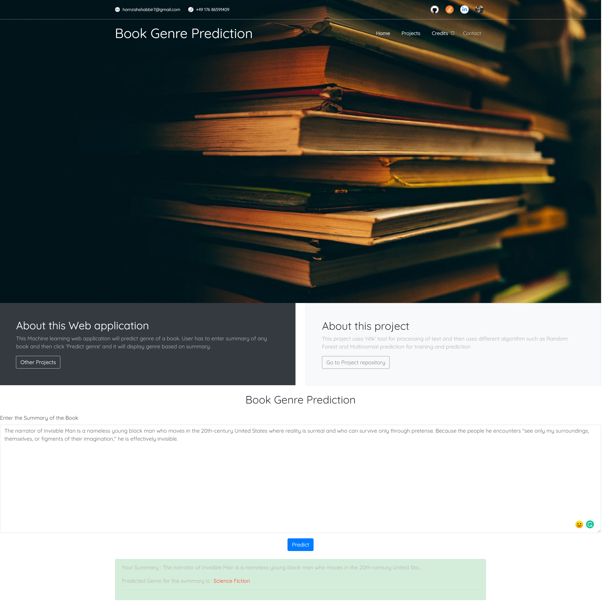
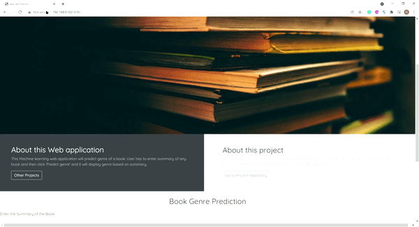

    
# Book Genre prediction using Machine learning

This Machine learning web application will predict genre of a book. User has to enter summary of any book and then click 'Predict genre' and it will display genre based on summary.  

## Authors

- [@hamzahshabbir](https://www.linkedin.com/in/hamzah-shabbir-108765a5/)

  
## Acknowledgements

 - [Scikit-Learn](https://scikit-learn.org/stable/)
 - [Natural Language Toolkit](https://www.nltk.org/)
 - [Flask](https://flask.palletsprojects.com/en/2.0.x/)

  
https://github.com/hamzahshabbir96/natural-language-genre-prediction/issues/1#issue-1059243551

  
## Feedback

If you have any feedback, please reach out to me at hamzahshabbir7@gmail.com

  
## 🔗 Links

  

